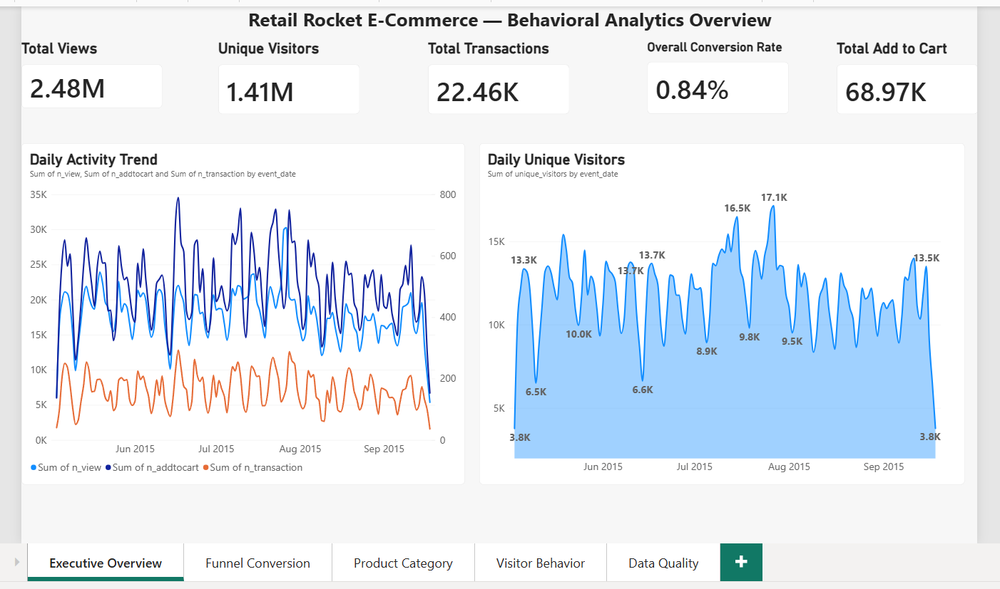
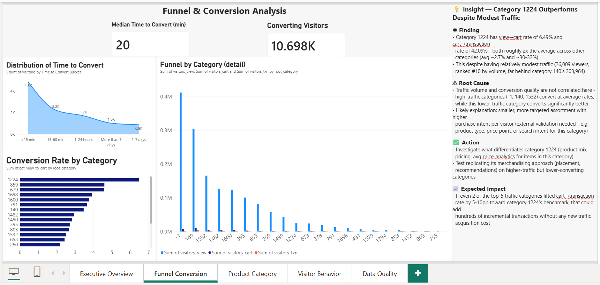
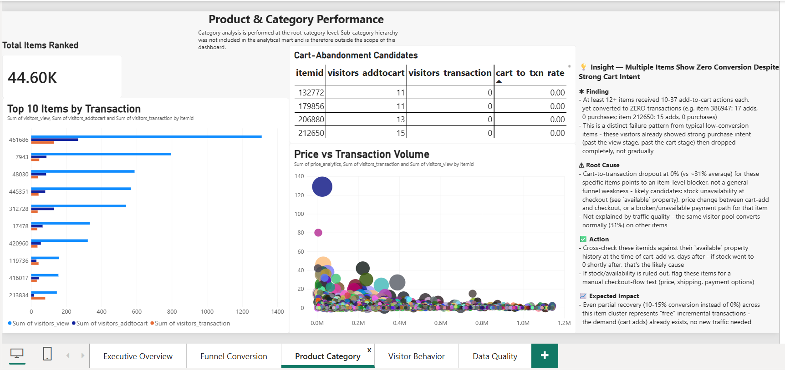
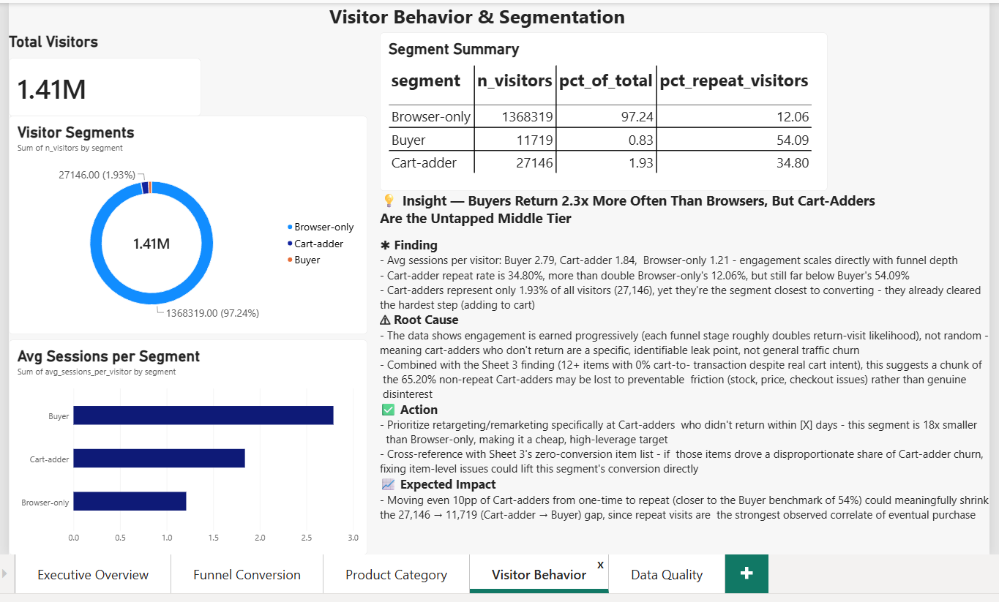
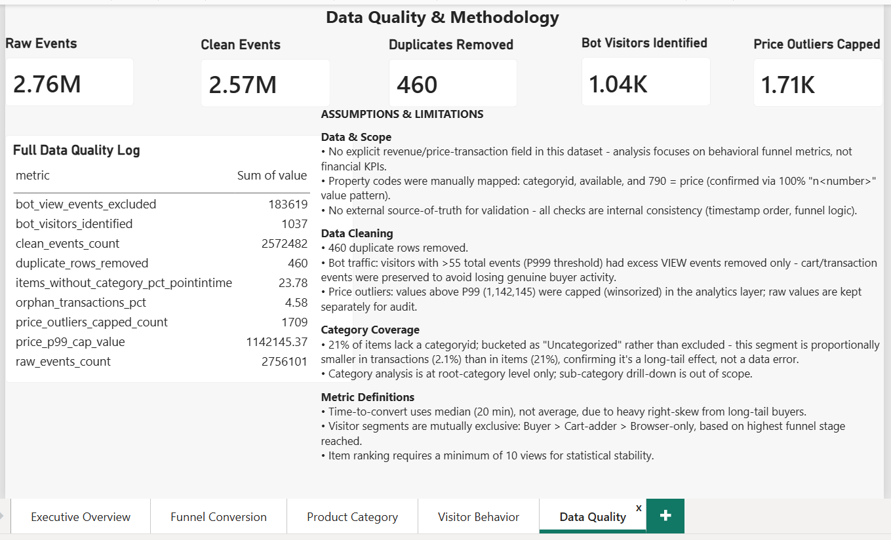

# Retail Rocket — End-to-End Data Analyst Portfolio Project

> Stack: DuckDB · SQL · Power BI · Git/GitHub · PowerShell
> Status: ✅ Complete (Business Understanding → Dashboard → Insights)

## Tentang Project Ini
Analisis end-to-end perilaku pengguna e-commerce menggunakan **Retail Rocket Recommender
System Dataset** — dari data mentah (events, item properties, category tree) sampai dashboard
Power BI 5 halaman. Dataset ini tidak memiliki data revenue eksplisit, sehingga analisis
difokuskan ke **funnel & conversion analytics** serta **perilaku pengunjung**, bukan metrik
finansial.

Seluruh pipeline (cleaning → modeling → EDA → mart) dibangun di **DuckDB**, dengan setiap
keputusan metodologi (threshold, filtering, winsorization) diinvestigasi dan didokumentasikan
sebelum diterapkan — lihat [`docs/assumptions.md`](docs/assumptions.md) untuk detail lengkap.

## Struktur Folder
```
retail_rocket_project/
├── data/
│   ├── raw/              # CSV asli — source of truth, tidak di-push ke git
│   └── processed/        # 9 mart siap pakai (.parquet)
├── sql/                  # Query per milestone (02-10)
├── dashboard/            # File Power BI (.pbix)
├── screenshots/          # Screenshot tiap halaman dashboard
├── docs/
│   ├── roadmap.md        # Roadmap 15 tahap + metodologi kerja
│   ├── assumptions.md    # Semua keputusan & temuan metodologi
│   └── insights.md       # Insight & business recommendation
├── retail_rocket.duckdb  # Database lokal (di-.gitignore)
└── run_milestone.ps1     # Script otomasi run→commit→push
```

## Cara Reproduce
1. Download dataset dari Kaggle (Retail Rocket Recommender System Dataset), taruh 4 CSV
   di `data/raw/`
2. Download DuckDB CLI dari duckdb.org, taruh `duckdb.exe` di root project
3. Jalankan tiap milestone berurutan:
   ```powershell
   .\duckdb.exe retail_rocket.duckdb
   ```
   ```sql
   .read sql/02_data_collection.sql
   .read sql/04_cleaning.sql
   .read sql/06_star_schema.sql
   .read sql/07_transformation.sql
   .read sql/08_eda.sql
   .read sql/09_analytical_dataset.sql
   .read sql/10_data_mart.sql
   ```
4. Buka `dashboard/retail_rocket_analytics.pbix` di Power BI Desktop — data akan ter-refresh
   dari parquet di `data/processed/`

## Dashboard — 5 Halaman

### 1. Overview
KPI cards (Total Views, Unique Visitors, Transactions, Conversion Rate), funnel ringkas, trend harian.



### 2. Funnel & Conversion
Conversion rate per kategori, time-to-convert (median), distribusi waktu konversi.



### 3. Product & Category Performance
Top 10 item by transaction, cart-abandonment candidates, price vs transaction volume.



### 4. Visitor Behavior & Segmentation
Segmentasi Buyer/Cart-adder/Browser-only (mutually exclusive), avg sessions per segmen.



### 5. Data Quality & Methodology
Metrik kuantitatif data cleaning + assumptions/limitations sebagai teks statis.



## Insight & Recommendation
3 insight utama (funnel per kategori, cart-abandonment cluster, retention gap antar segmen)
dengan struktur Finding → Root Cause → Action → Expected Impact — lihat
[`docs/insights.md`](docs/insights.md).

## Key Methodology Decisions
- **Bot filtering**: threshold P999 (>55 events), diterapkan hanya ke event `view` — bukan
  exclude seluruh visitor, supaya transaksi asli (buyer aktif) tidak ikut terbuang
- **Price outliers**: di-winsorize di P99 (raw value tetap disimpan untuk audit)
- **Category coverage**: item tanpa categoryid (21%) dikelompokkan sebagai "Uncategorized",
  bukan di-exclude — terbukti proporsinya di transaksi (2.1%) jauh lebih kecil dari di item (21%)
- **Visitor segmentation**: mutually exclusive berdasarkan funnel stage tertinggi
  (Buyer > Cart-adder > Browser-only), tervalidasi reconcile 100% ke total unique visitor

Detail lengkap semua keputusan ada di [`docs/assumptions.md`](docs/assumptions.md).

## Roadmap
Lihat [`docs/roadmap.md`](docs/roadmap.md) untuk roadmap lengkap 15 tahap, termasuk metode
kerja iteratif (investigasi → keputusan → revisi → dokumentasi → commit) yang dipakai konsisten
di seluruh project ini.
